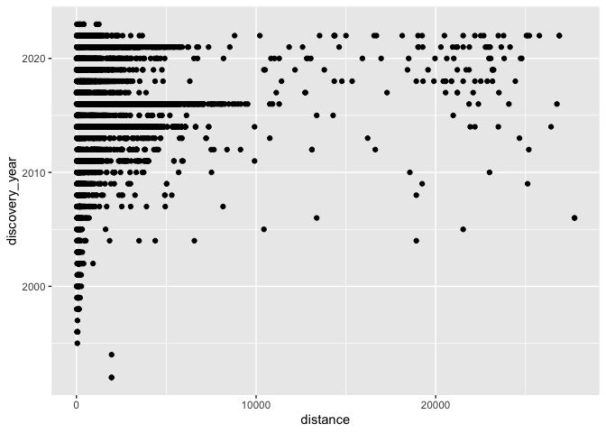

```r
library(tidyverse)
```

```
## ── Attaching packages ─────────────────────────────────────── tidyverse 1.3.2 ──
## ✔ ggplot2 3.4.0      ✔ purrr   1.0.0 
## ✔ tibble  3.1.8      ✔ dplyr   1.0.10
## ✔ tidyr   1.2.1      ✔ stringr 1.5.0 
## ✔ readr   2.1.3      ✔ forcats 0.5.2 
## ── Conflicts ────────────────────────────────────────── tidyverse_conflicts() ──
## ✖ dplyr::filter() masks stats::filter()
## ✖ dplyr::lag()    masks stats::lag()
```

```r
library(here)
```

```
## here() starts at /Users/babyyoda/Desktop/ProjectWinter2023-main
```

```r
library(janitor)
```

```
## 
## Attaching package: 'janitor'
## 
## The following objects are masked from 'package:stats':
## 
##     chisq.test, fisher.test
```

```r
library(shiny)
library(shinydashboard)
```

```
## 
## Attaching package: 'shinydashboard'
## 
## The following object is masked from 'package:graphics':
## 
##     box
```


```r
exoplanets <- read_csv("data/cleaned_5250.csv")
```

```
## Rows: 5250 Columns: 13
## ── Column specification ────────────────────────────────────────────────────────
## Delimiter: ","
## chr (5): name, planet_type, mass_wrt, radius_wrt, detection_method
## dbl (8): distance, stellar_magnitude, discovery_year, mass_multiplier, radiu...
## 
## ℹ Use `spec()` to retrieve the full column specification for this data.
## ℹ Specify the column types or set `show_col_types = FALSE` to quiet this message.
```


```r
glimpse(exoplanets)
```

```
## Rows: 5,250
## Columns: 13
## $ name              <chr> "11 Comae Berenices b", "11 Ursae Minoris b", "14 An…
## $ distance          <dbl> 304, 409, 246, 58, 69, 408, 249, 454, 313, 235, 235,…
## $ stellar_magnitude <dbl> 4.72307, 5.01300, 5.23133, 6.61935, 6.21500, 5.22606…
## $ planet_type       <chr> "Gas Giant", "Gas Giant", "Gas Giant", "Gas Giant", …
## $ discovery_year    <dbl> 2007, 2009, 2008, 2002, 1996, 2020, 2008, 2008, 2018…
## $ mass_multiplier   <dbl> 19.40000, 14.74000, 4.80000, 8.13881, 1.78000, 4.320…
## $ mass_wrt          <chr> "Jupiter", "Jupiter", "Jupiter", "Jupiter", "Jupiter…
## $ radius_multiplier <dbl> 1.080, 1.090, 1.150, 1.120, 1.200, 1.150, 1.110, 1.6…
## $ radius_wrt        <chr> "Jupiter", "Jupiter", "Jupiter", "Jupiter", "Jupiter…
## $ orbital_radius    <dbl> 1.290000, 1.530000, 0.830000, 2.773069, 1.660000, 1.…
## $ orbital_period    <dbl> 8.925394e-01, 1.400000e+00, 5.086927e-01, 4.800000e+…
## $ eccentricity      <dbl> 0.23, 0.08, 0.00, 0.37, 0.68, 0.06, 0.08, 0.00, 0.04…
## $ detection_method  <chr> "Radial Velocity", "Radial Velocity", "Radial Veloci…
```


```r
exoplanets %>% 
  ggplot(aes(x=distance, y=discovery_year)) +
  geom_point()
```

```
## Warning: Removed 17 rows containing missing values (`geom_point()`).
```

<!-- -->


```r
ui <- fluidPage(
    selectInput("x", "Select X Variable", choices = c("distance", "stellar_magnitude", "discovery_year", "mass_multiplier", "radius_multiplier", "orbital_period", "eccentricity"), 
              selected = "distance"),
    selectInput("y", "Select Y Variable", choices = c("distance", "stellar_magnitude", "discovery_year", "mass_multiplier", "radius_multiplier", "orbital_period", "eccentricity"), 
              selected = "mass_multiplier"),
    plotOutput("plot", width="500px", height="500px")
)

server <- function(input, output) {
  output$plot <- renderPlot({
    ggplot(data=exoplanets, aes_string(x=input$x, y=input$y))+
      geom_point()+
      theme_light(base_size=18)
  })
  
}

shinyApp(ui, server)
```

```
## PhantomJS not found. You can install it with webshot::install_phantomjs(). If it is installed, please make sure the phantomjs executable can be found via the PATH variable.
```

```{=html}
<div style="width: 100% ; height: 400px ; text-align: center; box-sizing: border-box; -moz-box-sizing: border-box; -webkit-box-sizing: border-box;" class="muted well">Shiny applications not supported in static R Markdown documents</div>
```

